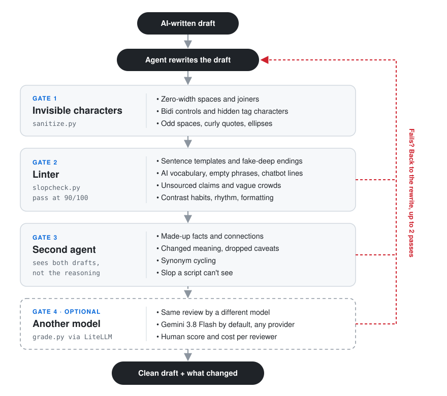

# anti-ai-slop

A skill for Claude Code, Codex, and other coding agents that removes AI-writing tells
from a draft and then checks the result before handing it back.

<p align="center">
  
</p>

## What it catches

### Sentence patterns

1. **Negative parallelism.** "It isn't a pricing problem. It's a trust problem."
2. **Throat-clearing openers.** "Here's the thing," "Let me be honest"
3. **Faux-insight setups.** "What most teams get wrong," "The part nobody mentions"
4. **Rhetorical setups.** "Think about it:" "Sound familiar?"
5. **Colon reveals.** "The clever part: it retries on its own."
6. **Trailing -ing analysis.** "...adds dark mode, underscoring its focus on users"
7. **Importance puffery.** "stands as a testament to," "cannot be overstated"
8. **Telling the reader what to think.** "As you can see," "The key takeaway here is"
9. **Fake-strong verbs.** "serves as a unified layer," "has the ability to"
10. **False agency.** "The consensus emerged." "The data tells us"
11. **Dramatic fragments.** "That's it. That's the product."
12. **Fake-profound endings.** "And we're just getting started."
13. **Recap endings.** "In conclusion," "To sum up"
14. **Vague declaratives.** "The stakes are high." "The implications are significant."
15. **Stacked hedges.** "could potentially," "it might be argued that"
16. **Half-and-half framing.** "Pricing is half the story. The other half is..."
17. **Stiff wording.** "only when the cheaper option will not do"

### Habits that only show up in bulk

18. **Contrast on every claim.** "a settings change rather than a code change,"
    "instead of waiting." One is fine. Three in a short post gets flagged.
19. **Too many rhetorical questions** that the post answers itself

### Words and phrases

20. **AI vocabulary.** "delve," "leverage," "seamless," "tapestry," and about 120 more
21. **Empty phrases.** "at its core," "in today's fast-paced world," and about 100 more
22. **Canned openers.** "Moreover," "Ultimately," "In essence"
23. **Chatbot leftovers.** "Great question," "Hope this helps," "feel free to"
24. **Unsourced claims.** "studies show," "experts agree"
25. **Vague crowds.** "most companies," "we all know"
26. **Filler words.** "truly," "basically," "incredibly"
27. **Sweeping words.** "everyone," "nobody," "always"

### Rhythm and formatting

28. **Same-length sentences** four times in a row
29. **Short punchy sentences** stacked four deep
30. **Em dashes** everywhere
31. **Emoji used as headings or bullets**
32. **Lists of three** used for rhythm, over and over
33. **Adjective stacks.** "powerful and intuitive"
34. **Random bold** in the middle of sentences
35. **Headings over one or two sentences**
36. **Title Case Headings**
37. **Invisible characters** like zero-width spaces

### Things only a second reviewer catches

38. **Made-up facts.** A number, source, or quote the original never had
39. **Made-up connections.** A time frame, a cause, or a reaction added while smoothing
    a sentence, like "over several quarters" or "the feature customers ask about most"
40. **Synonym cycling.** "The agent reviews the draft. The assistant scores it. The
    tool suggests fixes."
41. **Changed meaning.** A dropped caveat, a claim made stronger than the original, or
    an argument that stops making sense after the cuts

## How it works

You give your agent a draft. It rewrites it, and then the draft has to get through
four gates before you see it:

1. **Gate 1: invisible characters.** Removes zero-width spaces, hidden tag characters,
   bidi controls, and odd spacing that come along with pasted AI text. Emoji and
   non-Latin text are left alone.
2. **Gate 2: the linter.** A Python script scores the draft out of 100 against
   everything in the list above that a script can find. That covers sentence templates,
   AI vocabulary, empty phrases, chatbot leftovers, unsourced claims, contrast habits,
   rhythm, and formatting. It skips code and quotes, gives the same score every time,
   and needs 90 with no serious findings.
3. **Gate 3: a second agent.** It gets the original and the rewrite, but not the first
   agent's reasoning. It catches what a script can't: made-up facts, made-up
   connections, changed meaning, dropped caveats, synonym cycling, and any slop the
   linter missed.
4. **Gate 4, optional: another model.** The same review, run by Gemini 3.8 Flash by
   default through [LiteLLM](https://github.com/BerriAI/litellm). You can swap in any
   provider or add several, and each one reports a human score and its cost.

If a check fails, the draft goes back for another pass, up to two times. Anything
still unresolved is listed for you instead of hidden.

The second reviewer is there because the linter can't tell a real fact from an
invented one. In testing, rewrites that scored 100 on the linter still had details the
original never mentioned.

By default the skill assumes a model wrote the draft and cuts hard. If you say you
wrote it yourself, it keeps your voice and only fixes the obvious tells.

## Install

For Claude Code:

```bash
git clone https://github.com/misbahsy/anti-ai-slop.git
cp -r anti-ai-slop/skills/anti-ai-slop ~/.claude/skills/
```

For other agents, copy `skills/anti-ai-slop` into whatever folder your agent loads
skills from.

The checks need Python 3.8 or newer. The optional model review also needs LiteLLM:

```bash
pip install litellm
```

The first time you ask for a model review, the agent asks where your API key is stored
and runs everything for you. It saves where the key lives, never the key itself.

## Use it

Just ask your agent:

- "De-slop this blog post before I publish it."
- "ChatGPT wrote this email. Make it sound like me."
- "Does this read as AI-written? Point out the patterns but don't rewrite it."
- "Clean this up and have another model check it."

You get back the edited draft plus a short list of what changed, including anything it
cut because there was no source for it.

## Run the checks yourself

```bash
python3 skills/anti-ai-slop/scripts/sanitize.py draft.md --fix
python3 skills/anti-ai-slop/scripts/slopcheck.py draft.md
python3 skills/anti-ai-slop/scripts/grade.py original.md rewrite.md
```

`slopcheck.py` exits with 0 on a pass and 1 on a fail, so it works in a pre-commit
hook or CI.

If the linter flags something you want to keep, add a comment to that line:

```markdown
Our leverage ratio fell to 2.1x. <!-- slop-ignore W1 -->
```

## Tests

```bash
python3 skills/anti-ai-slop/tests/test_slopcheck.py
python3 skills/anti-ai-slop/tests/test_credentials.py
python3 skills/anti-ai-slop/tests/test_grade.py
```

No network or API keys needed. One of the tests checks that the skill's own docs pass
the linter.

## Adding rules

Everything the linter looks for lives in `skills/anti-ai-slop/scripts/rules.json`. Add
a word, phrase, or pattern there and rerun the tests. If the clean test file drops
below 95, the new rule is flagging normal writing.

## Inspired by

- [no-ai-slop](https://github.com/petergyang/no-ai-slop) by Peter Yang
- [stop-slop](https://github.com/hardikpandya/stop-slop) by Hardik Pandya
- [slop-cop](https://github.com/howshannon/slop-cop) by Shannon Tran
- [clearmode](https://github.com/eugeniughelbur/clearmode) by Eugeniu Ghelbur

## License

MIT
